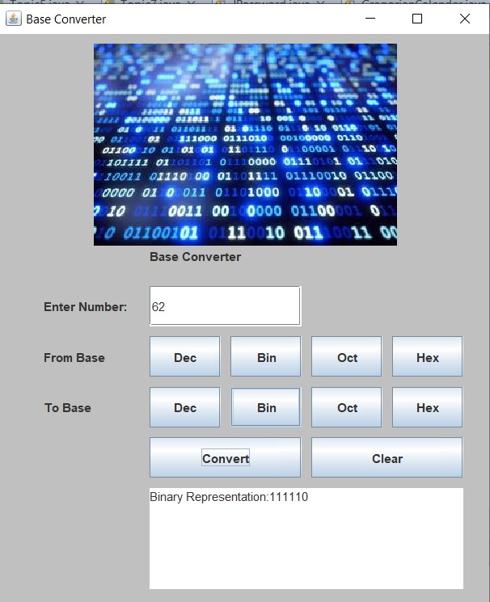

# 🧮 Base Converter System



**Base Converter** is a simple and intuitive Java Swing application that helps you convert numbers between different base systems:  
**Decimal (Dec), Binary (Bin), Octal (Oct), and Hexadecimal (Hex)**.

## 🚀 Features

- Convert numbers between any two base systems:
  - Decimal ↔ Binary
  - Decimal ↔ Octal
  - Decimal ↔ Hexadecimal
  - Binary ↔ Octal, Hex, etc.
- Easy-to-use graphical user interface (GUI)
- Real-time output display
- Includes a **Clear** button for resetting inputs and output
- Visually clean and minimal design with an informative image header

## 🖼️ Interface Overview

- Input Field: Enter the number to convert
- From Base: Select the base of the entered number
- To Base: Select the base you want to convert to
- Convert Button: Performs the conversion
- Clear Button: Clears all selections and input/output fields
- Output Area: Displays the converted result

## 🛠️ Technologies Used

- Java (JDK 8 or higher)
- Java Swing for GUI development

## 💡 Example

**Input:**  
- Number: `62`  
- From Base: Decimal  
- To Base: Binary  

**Output:**  
`Binary Representation: 111110`

## 🧑‍💻 How to Run

1. Clone the repository:
   ```bash
   https://github.com/Tanvir-Mahamood/Base-Converter-System.git
   ```

2. Open the project in any Java IDE (e.g., IntelliJ IDEA, Eclipse, NetBeans)
3. Compile and run the BaseConverter.java file
4. Use the GUI to input a number and select base conversions

## 📄 License
This project is open source and available under the [MIT License](LICENSE).

